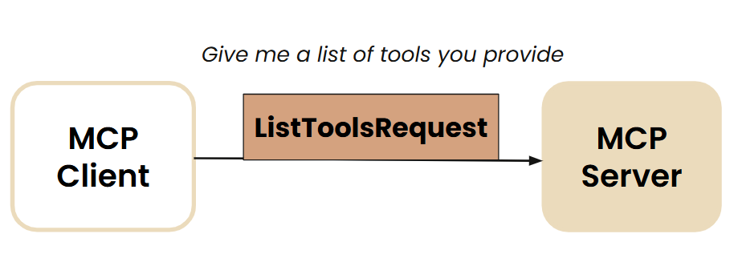
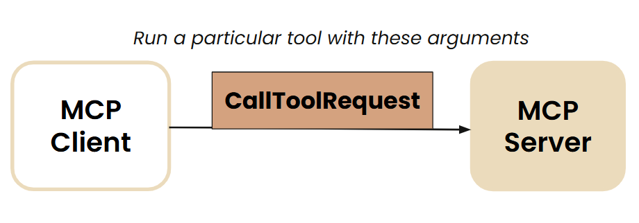

## Setup

```bash
pip install -r requirements.txt
```

## Environment Variables

```bash
GOOGLE_API_KEY=***
LLM_TIMEOUT=10
LLM_MAX_RETRIES=2
STREAMLIT_BROWSER_GATHER_USAGE_STATS=false
```

## Run

```bash
streamlit run chat_ui.py
```

## Simple LLM chat with function calling

```bash
PYTHONPATH=. python explore/llm_tool_use.py chat_loop
```

## Building MCP
MCP server needs to handle two main requests from the client:
- listing all the tools
  
   

- executing a particular tool
  
  

### Running MCP inspector
Install npm (if not already installed)
```bash
sudo apt-get install npm
```

Run the inspector
```bash
npx @modelcontextprotocol/inspector python tools/arxiv_research.py
```
