# Data Pipeline

## Overview

The Financial Agent Data Pipeline is a comprehensive document processing system that converts PDF documents into structured markdown content using AI-powered text extraction and chunking. It leverages Google's Gemini AI model for intelligent document parsing and provides flexible options for processing single files or batch processing multiple documents.

## Features

- **PDF Document Processing**: Convert PDF files to clean markdown format
- **Document Chunking**: Split large documents into manageable chunks with configurable overlap
- **Batch Processing**: Process multiple files in parallel for efficiency
- **AI-Powered Extraction**: Uses Google Gemini 2.0 Flash model for intelligent content extraction
- **Flexible Output**: Save results as CSV files or individual markdown files
- **Token-Based Splitting**: Smart text splitting based on token limits for various AI models

## Architecture

```mermaid
flowchart TD
    A[📄 PDF Documents] --> B{File Size Check}
    
    B -->|Large Files| C[📋 Split into Chunks]
    B -->|Small/Medium Files| D[🔄 Direct Processing]
    
    C --> E[📤 Upload to Gemini AI]
    D --> E
    
    E --> F[🤖 AI Processing]
    F --> G[📝 Clean Markdown]
    
    G --> H{Output Format}
    
    H -->|Single File| I[💾 Save .md File]
    H -->|Batch Processing| J[📊 Save CSV File]
    
    J --> K{Need Chunking?}
    I --> L[✅ Complete]
    
    K -->|Yes| M[🔪 Token-based Splitting]
    K -->|No| L
    
    M --> N[🏷️ Generate Chunk IDs]
    N --> O[📊 Chunked CSV Output]
    O --> P[🔍 Ready for RAG/Vector DB]
    P --> L
    
    style A fill:#e1f5fe
    style F fill:#f3e5f5
    style P fill:#e8f5e8
    style L fill:#fff3e0
```



## Prerequisites

### Dependencies

Install the required Python packages:

```bash
pip install pandas google-generativeai pypdf python-dotenv pandarallel tiktoken langchain-text-splitters fire
```

### Environment Setup

1. Create a `.env` file in your project root:
```bash
GOOGLE_API_KEY=your_google_api_key_here
```

2. Get a Google AI API key from [Google AI Studio](https://makersuite.google.com/app/apikey)

## Usage

### 1. Single File Processing

Convert a single PDF to markdown:

```python
from data_pipeline.file_parser import process_single_file

process_single_file(
    input_pdf_path="path/to/document.pdf",
    output_path="output/document.md"
)
```

**Command Line:**
```bash
python -m data_pipeline.file_parser process_single_file --input_pdf_path="document.pdf" --output_path="output.md"
```

### 2. Batch File Processing

Process multiple PDF files and save results to CSV:

```python
from data_pipeline.file_parser import process_files

file_paths = ["doc1.pdf", "doc2.pdf", "doc3.pdf"]
process_files(
    file_paths=file_paths,
    output_csv_path="processed_documents.csv",
    num_workers=4
)
```

**Command Line:**
```bash
python -m data_pipeline.file_parser process_files --file_paths='["doc1.pdf", "doc2.pdf"]' --output_csv_path="output.csv"
```

### 3. Large File Segmentation and Processing

For large PDF files, split them into chunks before processing:

```python
from data_pipeline.file_parser import segment_and_process_file

segment_and_process_file(
    input_pdf_path="large_document.pdf",
    output_csv_path="segmented_output.csv",
    output_folder="pdf_chunks/",
    num_pages=5,
    overlap=1
)
```

**Command Line:**
```bash
python -m data_pipeline.file_parser segment_and_process_file --input_pdf_path="large.pdf" --output_csv_path="output.csv" --output_folder="chunks/"
```

### 4. Document Chunking for RAG Applications

Split processed documents into token-based chunks:

```python
from data_pipeline.split_documents import split_documents

split_documents(
    input_csv_path="processed_documents.csv",
    output_csv_path="chunked_documents.csv",
    chunk_size=4000,
    chunk_overlap=1000,
    model_name="gpt-4o",
    col_content="cleaned_markdown",
    num_workers=8
)
```

**Command Line:**
```bash
python -m data_pipeline.split_documents --input_csv_path="input.csv" --output_csv_path="chunked.csv" --chunk_size=4000
```

## Configuration

### Model Settings (`configs.py`)

```python
GEMINI_MODEL = "gemini-2.0-flash"      # AI model for processing
TEMPERATURE = 0.7                       # AI creativity level
MAX_TOKENS = 8000                      # Maximum response length
TOKEN_THRESHOLD = 100                  # Minimum chunk size
```

### Processing Parameters

| Parameter | Description | Default |
|-----------|-------------|---------|
| `chunk_size` | Token limit per chunk | 4000 |
| `chunk_overlap` | Overlapping tokens between chunks | 1000 |
| `num_pages` | Pages per PDF segment | 5 |
| `overlap` | Page overlap in segmentation | 1 |
| `num_workers` | Parallel processing workers | 4-8 |

## Output Formats

### CSV Output Structure

```csv
doc_id,local_path,url,metadata,cleaned_markdown,org_id,org_cleaned_markdown
uuid-1,file1.pdf,gemini://...,{...},markdown_content,...,...
uuid-2,file1.pdf,gemini://...,{...},chunk_content,...,...
```

### Markdown Output

Clean, structured markdown with:
- Proper headers and formatting
- Code blocks preserved
- Navigation and ads removed
- Original content structure maintained

## Best Practices

1. **File Size Management**: Use segmentation for files > 50 pages
2. **Batch Processing**: Process multiple small files together for efficiency
3. **Token Limits**: Adjust chunk sizes based on your downstream AI model requirements
4. **Error Handling**: Monitor API rate limits and file processing status
5. **Storage**: Consider storage costs for large document collections

## Troubleshooting

### Common Issues

1. **API Key Error**: Ensure `GOOGLE_API_KEY` is set in your `.env` file
2. **File Processing Timeout**: Large files may need longer processing time
3. **Memory Issues**: Reduce `num_workers` for large batch processing
4. **Token Limits**: Adjust `chunk_size` if hitting model token limits

### Monitoring Progress

The pipeline provides progress bars and status messages:
- File upload progress
- Processing status for each document
- Chunk generation progress
- Final output confirmation

## Examples

### Complete Workflow Example

```python
# 1. Process a large PDF with segmentation
from data_pipeline.file_parser import segment_and_process_file

segment_and_process_file(
    input_pdf_path="financial_report.pdf",
    output_csv_path="report_segments.csv",
    output_folder="temp_chunks/",
    num_pages=10,
    overlap=2
)

# 2. Split into RAG-ready chunks
from data_pipeline.split_documents import split_documents

split_documents(
    input_csv_path="report_segments.csv",
    output_csv_path="rag_ready_chunks.csv",
    chunk_size=3000,
    chunk_overlap=500,
    model_name="gpt-4o"
)
```

### Integration with RAG Systems

The chunked output is ready for vector database ingestion:

```python
import pandas as pd

# Load processed chunks
df = pd.read_csv("rag_ready_chunks.csv")

# Each row contains:
# - doc_id: Unique identifier
# - cleaned_markdown: Processed content
# - org_id: Original document reference
# - metadata: File information

for _, row in df.iterrows():
    # Embed and store in vector database
    embedding = embed_text(row['cleaned_markdown'])
    vector_db.store(
        id=row['doc_id'],
        content=row['cleaned_markdown'],
        embedding=embedding,
        metadata=row['metadata']
    )
```

## API Reference

### Core Functions

- `process_single_file(input_pdf_path, output_path)`: Single file processing
- `process_files(file_paths, output_csv_path, num_workers)`: Batch processing
- `segment_and_process_file(...)`: Large file segmentation and processing
- `split_documents(...)`: Token-based document chunking
- `split_pdf(input_pdf, output_folder, num_pages, overlap)`: PDF segmentation

### Utility Functions

- `upload_to_gemini(path, mime_type)`: Upload file to Gemini API
- `wait_for_files_active(files)`: Wait for file processing completion
- `split_single_document(document, chunk_size, ...)`: Split single document

---

For more information or support, please refer to the source code documentation or create an issue in the project repository.
