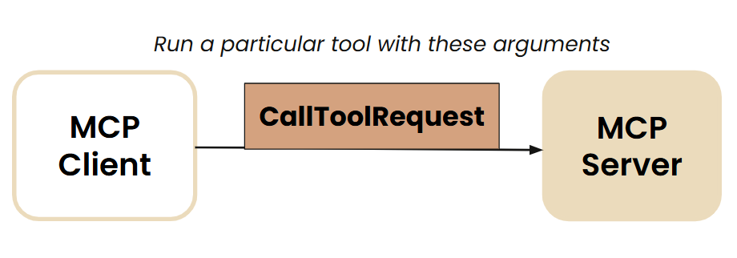

## Simple LLM chat with function calling

```bash
PYTHONPATH=. python explore/llm_tool_use.py chat_loop
```

## Building MCP
MCP server needs to handle two main requests from the client:
- listing all the tools
  
   

- executing a particular tool
  
  

### Running MCP inspector
Install npm (if not already installed)
```bash
sudo apt-get install npm
```

1. Arxiv research server
```bash
npx @modelcontextprotocol/inspector python explore/tools/arxiv_research.py
```

2. Fetch server
```bash
cd servers/src/fetch
npx @modelcontextprotocol/inspector uv run mcp-server-fetch
```

3. File system server

```bash
# from current directory
npx @modelcontextprotocol/inspector npx -y @modelcontextprotocol/server-filesystem
```


### MCP chatbot

```bash
PYTHONPATH=. python explore/mcp_chatbot.py
```
