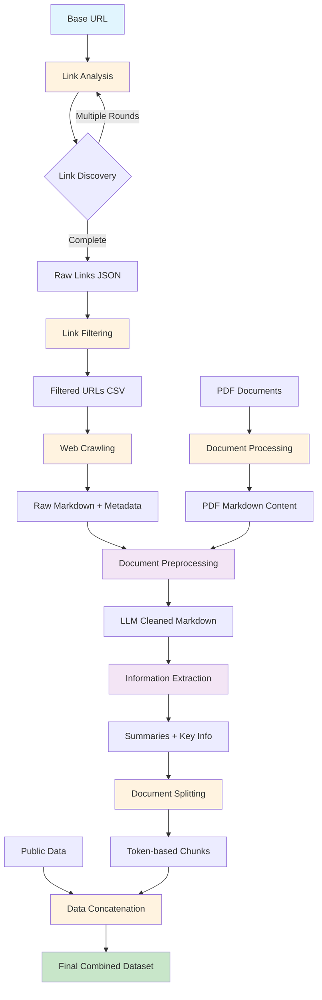

# Data Pipeline

A comprehensive data pipeline for web crawling, document processing, and information extraction using AI models. This pipeline is designed to crawl websites, process documents (PDFs and web content), clean and structure the data, and extract key information using Large Language Models.

## 🏗️ Pipeline Architecture

The data pipeline consists of the following components:



### Pipeline Flow Description

1. **🔍 Link Analysis** - Discovers internal links from base URL through multiple crawling rounds
2. **🔧 Link Filtering** - Filters and cleans discovered links based on domain patterns and criteria
3. **🌐 Web Crawling** - Extracts content from filtered URLs and converts to markdown
4. **📄 Document Processing** - Processes PDF documents and converts to markdown (parallel path)
5. **🧹 Preprocessing** - Uses LLM to clean and structure raw markdown content
6. **📊 Information Extraction** - Extracts summaries and key information using AI
7. **✂️ Document Splitting** - Splits large documents into manageable token-based chunks
8. **🔗 Data Concatenation** - Combines processed data with external datasets

### Component Overview

| Component | Purpose | Input | Output |
|-----------|---------|-------|--------|
| **Link Analysis** | Discover and analyze website links | Base URL | JSON with discovered links |
| **Link Filtering** | Filter and clean discovered links | Raw links JSON | Filtered CSV of links |
| **Web Crawling** | Extract content from web pages | URLs list | Markdown content + metadata |
| **Document Processing** | Process PDF documents | PDF files | Cleaned markdown content |
| **Preprocessing** | Clean and structure content | Raw markdown | LLM-cleaned markdown |
| **Information Extraction** | Extract key information | Cleaned content | Summaries + key info |
| **Document Splitting** | Split documents into chunks | Large documents | Token-based chunks |
| **Data Concatenation** | Combine multiple datasets | Multiple CSV files | Combined dataset |

## 📁 File Structure

```
data_pipeline/
├── configs.py              # Configuration constants
├── prompts.py              # LLM prompts for various tasks
├── link_analysis.py        # Website link discovery and analysis
├── link_filtering.py       # URL filtering and cleaning
├── crawl_data.py          # Web content crawling
├── file_parser.py         # PDF document processing
├── preprocess_doc.py      # Document cleaning and preprocessing
├── extract_info.py        # Information extraction using LLM
├── split_documents.py     # Document chunking
└── concat_data.py         # Data concatenation utilities
```

## 🔧 Setup and Configuration

### Prerequisites

```bash
pip install crawl4ai pandas tqdm google-generativeai pypdf python-dotenv pandarallel tiktoken langchain-text-splitters fire
```

### Environment Variables

Create a `.env` file with:
```bash
GOOGLE_API_KEY=your_gemini_api_key_here
```

### Configuration

Edit `configs.py` to customize:
- Model selection (Gemini/OpenAI)
- Temperature and token limits
- Processing thresholds

## 🚀 Usage Examples

### 1. Link Analysis & Discovery

Discover all internal links from a website:

```python
from data_pipeline.link_analysis import recursive_link_analysis

# Analyze website links
result = recursive_link_analysis(
    base_url="https://example.com",
    n_rounds=3,                    # Number of crawling rounds
    n_workers=8,                   # Parallel workers
    max_urls=100,                  # Maximum URLs to discover
    output_file="discovered_links.json"
)
```

**Command Line:**
```bash
python link_analysis.py --base_url="https://example.com" --n_rounds=3 --output_file="links.json"
```

### 2. Link Filtering

Filter discovered links based on criteria:

```python
from data_pipeline.link_filtering import main

# Filter links by domain prefix
main(
    input_json_paths=["discovered_links.json"],
    output_csv_path="filtered_links.csv",
    prefix_filter="https://example.com/products"
)
```

**Command Line:**
```bash
python link_filtering.py --input_json_paths="links.json" --output_csv_path="filtered.csv" --prefix_filter="https://example.com"
```

### 3. Web Crawling

Crawl web pages and extract content:

```python
from data_pipeline.crawl_data import craw_data

# Crawl URLs and extract markdown content
craw_data(
    input_urls_file="filtered_links.csv",
    output_file="crawled_data.csv",
    num_workers=8,
    folder_to_save="crawled_content/",
    debug=False
)
```

**Command Line:**
```bash
python crawl_data.py --input_urls_file="urls.csv" --output_file="crawled.csv" --num_workers=8 --folder_to_save="output/"
```

### 4. PDF Document Processing

Process PDF documents into markdown:

```python
from data_pipeline.file_parser import process_files

# Process PDF files
pdf_files = ["doc1.pdf", "doc2.pdf", "doc3.pdf"]
process_files(
    file_paths=pdf_files,
    output_csv_path="processed_pdfs.csv",
    num_workers=4
)
```

**For single PDF:**
```python
from data_pipeline.file_parser import process_single_file

process_single_file(
    input_pdf_path="document.pdf",
    output_path="document.md"
)
```

### 5. Document Preprocessing

Clean and structure raw content using LLM:

```python
from data_pipeline.preprocess_doc import preprocess_document

# Clean crawled content
preprocess_document(
    crawled_data_path="crawled_data.csv",
    cleaned_csv_output="cleaned_data.csv",
    model="gemini-2.0-flash",
    num_workers=8,
    cleaned_md_dir="cleaned_markdown/",
    debug=False
)
```

**Command Line:**
```bash
python preprocess_doc.py --crawled_data_path="raw.csv" --cleaned_csv_output="clean.csv" --num_workers=8
```

### 6. Information Extraction

Extract summaries and key information:

```python
from data_pipeline.extract_info import parallel_enrich_data

# Extract key information and summaries
parallel_enrich_data(
    cleaned_csv_path="cleaned_data.csv",
    enriched_csv_output="enriched_data.csv",
    model="gemini-2.0-flash",
    batch_size=2,
    num_workers=2,
    enriched_data_dir="enriched_data/",
    debug=False
)
```

**Command Line:**
```bash
python extract_info.py --cleaned_csv_path="clean.csv" --enriched_csv_output="enriched.csv"
```

### 7. Document Splitting

Split large documents into smaller chunks:

```python
from data_pipeline.split_documents import split_documents

# Split documents into token-based chunks
split_documents(
    input_csv_path="enriched_data.csv",
    output_csv_path="split_documents.csv",
    chunk_size=4000,
    chunk_overlap=1000,
    model_name="gpt-4o",
    col_content="cleaned_markdown",
    num_workers=8
)
```

**Command Line:**
```bash
python split_documents.py --input_csv_path="data.csv" --output_csv_path="chunks.csv" --chunk_size=4000
```

### 8. Data Concatenation

Combine multiple datasets:

```python
from data_pipeline.concat_data import concat_dataframes

# Combine public and internal data
concat_dataframes(
    public_data_path="public_data.csv",
    internal_data_path="internal_data.csv",
    output_csv_path="combined_data.csv",
    concat_columns=["doc_id", "url", "metadata", "cleaned_markdown"]
)
```

**Command Line:**
```bash
python concat_data.py --public_data_path="public.csv" --internal_data_path="internal.csv" --output_csv_path="combined.csv"
```

## 🔄 Complete Pipeline Example

Here's how to run the complete pipeline:

```python
# 1. Discover links
from data_pipeline.link_analysis import recursive_link_analysis
recursive_link_analysis(
    base_url="https://example.com",
    n_rounds=2,
    output_file="links.json"
)

# 2. Filter links
from data_pipeline.link_filtering import main
main(
    input_json_paths="links.json",
    output_csv_path="filtered_links.csv",
    prefix_filter="https://example.com"
)

# 3. Crawl content
from data_pipeline.crawl_data import craw_data
craw_data(
    input_urls_file="filtered_links.csv",
    output_file="crawled.csv",
    folder_to_save="crawled/"
)

# 4. Preprocess content
from data_pipeline.preprocess_doc import preprocess_document
preprocess_document(
    crawled_data_path="crawled.csv",
    cleaned_csv_output="cleaned.csv"
)

# 5. Extract information
from data_pipeline.extract_info import parallel_enrich_data
parallel_enrich_data(
    cleaned_csv_path="cleaned.csv",
    enriched_csv_output="enriched.csv"
)

# 6. Split documents
from data_pipeline.split_documents import split_documents
split_documents(
    input_csv_path="enriched.csv",
    output_csv_path="final_data.csv"
)
```

## 📊 Data Format

### Input Formats
- **URLs**: CSV with `href` column or JSON with URL objects
- **PDFs**: Local file paths
- **Raw Content**: CSV with `crawled_markdown` column

### Output Formats
- **Crawled Data**: CSV with `doc_id`, `url`, `crawled_markdown`, `metadata`
- **Cleaned Data**: CSV with additional `cleaned_markdown` column
- **Enriched Data**: CSV with `summary` and `key_info` columns
- **Split Data**: CSV with chunked content and new `doc_id` per chunk

## ⚙️ Configuration Options

### Model Settings
```python
# In configs.py
GEMINI_MODEL = "gemini-2.0-flash"
TEMPERATURE = 0.7
MAX_TOKENS = 8000
```

### Processing Parameters
- **Workers**: Number of parallel workers (default: 8)
- **Batch Size**: Items per batch for memory management (default: 2)
- **Chunk Size**: Token limit per document chunk (default: 4000)
- **Chunk Overlap**: Overlapping tokens between chunks (default: 1000)

## 🔍 Monitoring and Debugging

### Debug Mode
Most functions support a `debug=True` parameter to process only a small sample:

```python
# Process only 4 samples for testing
preprocess_document(
    crawled_data_path="data.csv",
    cleaned_csv_output="test.csv",
    debug=True
)
```

### Logging
The pipeline uses Python's logging module. Set log levels:

```python
import logging
logging.basicConfig(level=logging.INFO)
```

